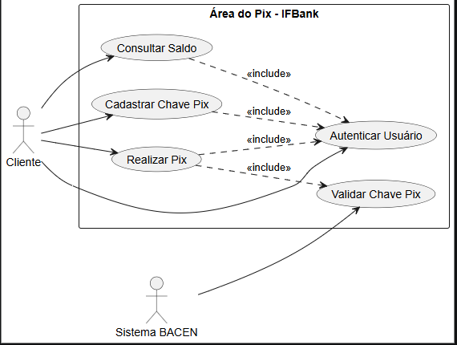
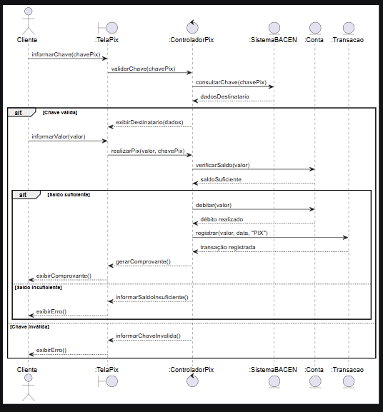
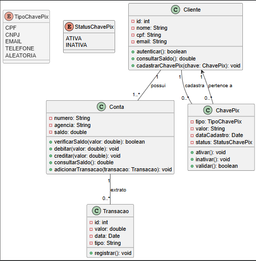

# Dossiê de Análise — Área do Pix IFBank

## 1. Introdução

Este documento apresenta a análise da funcionalidade **Área do Pix** do IFBank, contemplando os casos de uso, o fluxo de interação entre os componentes do sistema e a estrutura das principais classes envolvidas.

O objetivo é representar o funcionamento da realização de um Pix desde a identificação da chave do destinatário até o registro da transação e geração do comprovante.

---

# 2. Etapa 1 — Levantamento dos Casos de Uso

## 2.1 Diagrama de Casos de Uso

O diagrama apresenta os principais atores e funcionalidades da Área do Pix.

### Atores

- **Cliente:** utiliza o aplicativo para consultar saldo, cadastrar chaves Pix e realizar transferências.
- **Sistema BACEN:** realiza a validação da chave Pix de destino.

### Casos de Uso Principais

- Autenticar Usuário
- Consultar Saldo
- Cadastrar Chave Pix
- Realizar Pix
- Validar Chave Pix

O caso de uso **Realizar Pix** inclui a autenticação do usuário e a validação da chave Pix.

---

## 2.2 Descrição Textual — Realizar Pix

### Identificação

| Item | Descrição |
|---|---|
| **Caso de uso** | Realizar Pix |
| **Ator principal** | Cliente |
| **Ator secundário** | Sistema BACEN |
| **Objetivo** | Permitir que o cliente realize uma transferência via Pix |

### Pré-condições

- O cliente deve estar autenticado no aplicativo.
- O cliente deve possuir uma conta ativa.
- A conta deve possuir saldo suficiente para realizar a transferência.

### Fluxo Principal

1. O cliente acessa a opção **Realizar Pix**.
2. O sistema apresenta a tela de transferência.
3. O cliente informa a chave Pix do destinatário.
4. O sistema solicita ao BACEN a validação da chave.
5. O BACEN verifica a chave e retorna os dados do destinatário.
6. O sistema apresenta os dados do destinatário ao cliente.
7. O cliente informa o valor da transferência.
8. O sistema verifica se existe saldo suficiente na conta.
9. O sistema debita o valor da conta do cliente.
10. O sistema registra a transação no extrato.
11. O sistema gera o comprovante da operação.
12. O comprovante é apresentado ao cliente.
13. O caso de uso é encerrado com sucesso.

### Fluxos de Exceção

#### [FE-01] Saldo Insuficiente

1. O sistema verifica o saldo da conta.
2. O saldo disponível é menor que o valor informado.
3. O sistema informa ao cliente que o saldo é insuficiente.
4. O débito e a transferência não são realizados.
5. O caso de uso é encerrado.

#### [FE-02] Chave Pix Inválida

1. O sistema envia a chave Pix para validação no BACEN.
2. O BACEN informa que a chave não existe ou é inválida.
3. O sistema informa o cliente sobre a chave inválida.
4. A transferência não é realizada.
5. O caso de uso é encerrado.

---

# 3. Etapa 2 — Diagrama de Sequência

O diagrama de sequência representa a comunicação entre o cliente, a tela do Pix, o controlador, o BACEN, a conta e a transação durante a realização de um Pix.

### Principais Interações

1. O cliente informa a chave Pix.
2. A `TelaPix` solicita ao `ControladorPix` a validação da chave.
3. O controlador consulta o `SistemaBACEN`.
4. Após a validação da chave, o cliente informa o valor.
5. O controlador solicita à `Conta` a verificação do saldo.
6. Caso o saldo seja suficiente, o valor é debitado.
7. A transação é registrada no extrato.
8. O comprovante é gerado e apresentado ao cliente.

O bloco **alt/else** representa os dois possíveis resultados da verificação de saldo: saldo suficiente ou saldo insuficiente.

---

# 4. Etapa 3 — Diagrama de Classes

O diagrama de classes representa a estrutura das principais entidades responsáveis pelo funcionamento da Área do Pix.

### Classes Principais

- **Cliente:** representa o usuário do banco e possui contas e chaves Pix.
- **Conta:** armazena informações da conta e controla o saldo e as movimentações.
- **Transacao:** representa as operações financeiras registradas no extrato.
- **ChavePix:** representa uma chave Pix cadastrada pelo cliente.

### Principais Relacionamentos

- Um **Cliente** possui uma ou mais **Contas**.
- Um **Cliente** pode possuir várias **Chaves Pix**.
- Uma **Conta** pode possuir várias **Transações** no seu extrato.
- Uma **Chave Pix** pertence a um **Cliente**.

### Encapsulamento

Os atributos das classes são privados (`-`), enquanto os métodos disponibilizados para utilização pelas outras classes são públicos (`+`).

### Principais Métodos

- `Conta.debitar(valor)`
- `Conta.creditar(valor)`
- `Conta.verificarSaldo(valor)`
- `Conta.consultarSaldo()`
- `ChavePix.validar()`
- `ChavePix.ativar()`
- `ChavePix.inativar()`

---

# 5. Conclusão

A análise da Área do Pix do IFBank permite visualizar as principais funcionalidades, o fluxo de realização de uma transferência e a estrutura dos objetos envolvidos.

O processo garante que o cliente esteja autenticado, que a chave Pix seja validada pelo BACEN e que exista saldo suficiente antes da realização da transferência.

Após uma operação bem-sucedida, o valor é debitado, a transação é registrada no extrato e um comprovante é disponibilizado ao cliente.

Assim, os diagramas de **Casos de Uso, Sequência e Classes** representam os principais requisitos e comportamentos necessários para o funcionamento do módulo de Pix.
