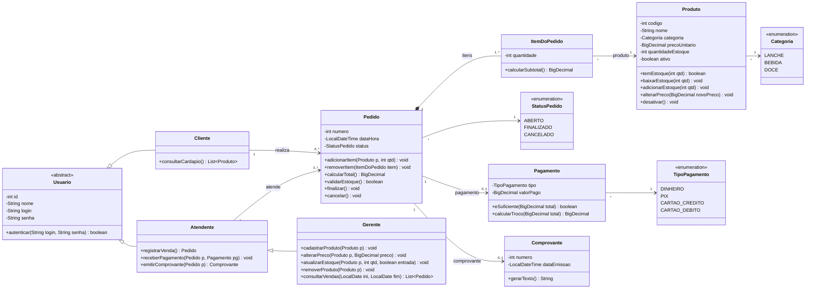

## Tarefa 2 – Diagrama de Classes

### Relacionamentos

| Relacionamento | Tipo | Multiplicidade | Justificativa |
|---|---|---|---|
| Pedido ◆— ItemDoPedido | **Composição** | 1 para 1..* | O item não existe sem o pedido, e o pedido precisa de ao menos um item para ser finalizado. |
| ItemDoPedido → Produto | **Associação** | * para 1 | O item referencia um produto. O produto continua existindo sem o item. |
| Pedido → Pagamento | **Associação** | 1 para 0..1 | O pedido começa sem pagamento e passa a ter um ao ser quitado. |
| Pagamento → TipoPagamento | **Associação** | * para 1 | O tipo é um enum: DINHEIRO, PIX, CARTÃO. |
| Produto → Categoria | **Associação** | * para 1 | A categoria é um enum: lanche, bebida, doce. |
| Usuario ◁— Cliente / Atendente | **Generalização** | — | Compartilham id, nome e login. |
| Atendente ◁— Gerente | **Generalização** | — | O gerente pode fazer tudo o que o atendente faz e mais a administração do cardápio. |
| Cliente → Pedido | **Associação** | 1 para 0..* | Papel: *realiza*. |
| Atendente → Pedido | **Associação** | 1 para 0..* | Papel: *atende*. |
| Pedido → Comprovante | **Associação** | 1 para 0..1 | O comprovante só é emitido depois que a venda é finalizada. |

### Decisões de projeto

- **Pedido calcula o total e Pagamento só registra a quitação.** O método `calcularTotal()` fica em `Pedido`, que soma os subtotais dos itens. `Pagamento` recebe o total como parâmetro em `eSuficiente()` e `calcularTroco()`, conforme o enunciado.
- **Data e hora** ficam em `Pedido.dataHora`, preenchida ao finalizar a venda.
- **Remoção de produto:** usei o atributo `ativo` (remoção lógica) em vez de apagar o registro. Isso preserva o histórico de vendas, já que pedidos antigos continuam apontando para o produto.
- **Preço no item:** se quiser que uma alteração de preço não afete vendas passadas, adicione `precoUnitario` em `ItemDoPedido`, guardando o preço do momento da venda.
- **Tipo monetário:** `BigDecimal`, o mais adequado em Java para valores em reais.